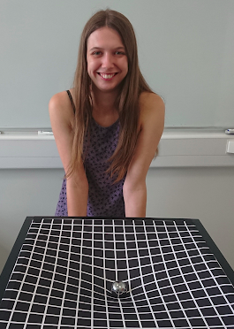

# {{site.title}}

Hello, and welcome to my homepage! I'm a [researcher in gravitational-wave cosmology at the University of Glasgow](https://www.gla.ac.uk/schools/physics/staff/rachelgray/) in Scotland.

## About me

I completed my MSci in Physics and Astronomy at the University of Glasgow in 2017, and went on to do a PhD with the Institute for Gravitational Research there. I gained my PhD in 2021, and started a Postdoc at Queen Mary University of London. In 2023 I became a lecturer at the University of Glasgow, where my time is split between research and teaching.

My research focuses on gravitational wave cosmology, in particular using galaxy catalogues and electromagnetic counterparts in combination with detections of gravitational waves from compact binary coalesences to infer cosmological parameters such as the Hubble constant. I'm also a member of the LIGO Scientific Collaboration, and currently co-chair the LIGO-Virgo-KAGRA Cosmology Working Group. You can find out more about my research using the menu on the left.

## Contact details

Dr. Rachel Gray

Institute for Gravitational Research, \
School of Physics & Astronomy, \
Room 607, \
Kelvin Building, \
University of Glasgow, \
Glasgow, G12 8QQ

Email: Rachel.Gray [at] glasgow.ac.uk
